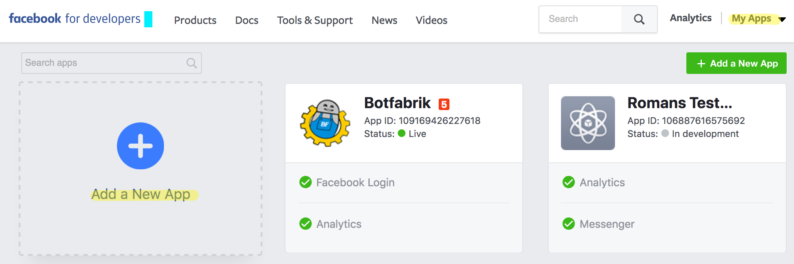
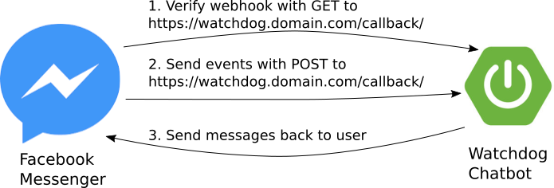
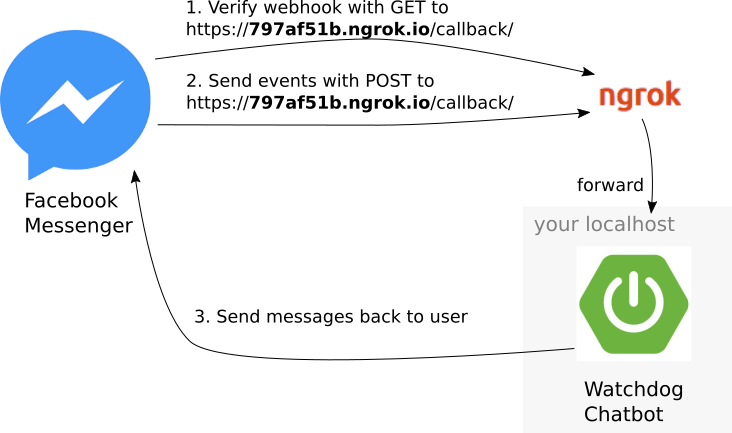

# Java Messenger Watchdog

The Java Messenger Watchdog helps you to keep an eye on your Websites. As soon as a watched site
is down, the watchdog will bark at you on Facebook Messenger.

[](https://travis-ci.org/chatbot-workshop/java-messenger-watchdog)

This project was used for a workshop I gave for the .
Therefore this readme is made to guide you through the process of bringing this chatbot to life and
continue to implement your own ideas.

## Preconditions
I expect you to be familiar with following technologies and concepts:

- The java programming language
- Your IDE (preferably IntelliJ IDEA or Eclipse)
- Build and dependency management tool (preferably gradle)

You should also be prepared to give Facebook some of your personal data. You can't create a Facebook app without revealing
your mobile number.

## Homework before the workshop starts
There are some things you have to do before we can start the workshop.

|  | The homework is very important because in some circumstances you have to wait for Facebook approval for a day or more. So we can't do this just at the workshop itself. |
|---------------|:----|

The homework consists of following things you should do prior to the workshop:

- Create Facebook account
- Create Facebook developer account
- Create Facebook page
- Create Facebook app
- Checkout this project

Don't hesitate to contact me through [Issues](https://github.com/chatbot-workshop/java-messenger-watchdog/issues) if you have questions or troubles to get the homework done.

### Create a Facebook account
I think I don't have to explain this step. I just wanted to be clear on this that you need it.

### Create a Facebook developer account
Go to [https://developers.facebook.com](https://developers.facebook.com) and create a developer
account. Be prepared to enter your phone number! You will receive a verification code which you
have to enter again. In some cases you have to wait for the approval from facebook.
This can take some hours to be completed.

### Facebook page
Your chatbot will run on a Facebook page. Therefore we create our own page for this bot. Go to
[Facebook](https://www.facebook.com/) and click the icon on the top left corner:


Now you can create a page by clicking at the verry bottom of the left menu:


Now you have to choose a page type. It does not matter what you choose. You can create a chatbot for
every page type.


When you finished the input, click on `Get Started`. You will be forwarded to the setup assistant.
Fill out as much as you need. After some steps you will have your own Facebook page.

You can make it easyer for visitors to get in touch with your chatbot by adding a Messenger button to your
page:


Now you can open the messenger window by testing your new button:


### Create a Facebook app
With a Facebook app you get the access to various APIs. For our chatbot we need the messenger APIs.

First go to [https://developers.facebook.com](https://developers.facebook.com) with your newly created
developer account. Click on `My Apps` and then `Add a New App`.


Now enter the display name and contact e-mail of your app and click `Create App ID`.


On your newly created app click `+ Add Product` and choose Messenger.


### Get the code

Now you should check out [this project](https://github.com/chatbot-workshop/java-messenger-watchdog) and import it to your IDE. Build the project in the IDE or enter
following command in your shell: `./gradlew build`. If you got no error in the IDE and a successful build
you are ready to start the workshop.

|  | Homework finished! Thank you for preparing yourself properly! |
|---------------|:----|

### Communication between your app and Facebook

First we want to have a look at how the Facebook API looks like.
This diagram shows how your chatbot will talk to facebook and vice versa:



1. First there is a verification step before Facebook is willing to communicate with your chatbot.
Facebook will fist call your chatbot using an http GET request to your **webhook** with a secret that
only you know. The secret is called **verify token**. If the correct **verify token** is sent, you
should answer with an http status 200.

2. Then all events from Facebook Messenger will be sent to you using http POST requests. This requests
will all arrive at your **webhook**. 

3. If you want to send a message back to your user, you have to perform separate calls to Facebook.
This time you have to verify that it is really you calling. This is done by attaching the **page access
token**.

Now that you are familiar with those key concepts, we can introduce another extra layer of complexity:
Facebook only talks through https to hosts with a valid SSL certificate. Your local development machine 
probably doesn't have a public domain and certificate. But you can use a service called
[ngrok](https://ngrok.com/) to solve this problem. Now the communication channel for development
environment looks like this:



[Ngrok](https://ngrok.com/) basically creates a new domain on the fly and routes all the traffic to
your machine. You can download ngrok from their website and run with following command:

```
$ ngrok http 8080
```

It will output following lines:

```
ngrok by @inconshreveable                                (Ctrl+C to quit)

Session Status                online
Version                       2.2.8
Region                        United States (us)
Web Interface                 http://127.0.0.1:4040
Forwarding                    http://797af51b.ngrok.io -> localhost:8080
Forwarding                    https://797af51b.ngrok.io -> localhost:8080
```

Now you have your own ngrok domain and certificate. Use the https forwarding url as your webhook:
`https://797af51b.ngrok.io/webhook`


### Connect Facebook app to your chatbot

Next we are going to actually connect your chatbot. To do this we have to set some properties and
tell Facebook where your chatbot is living.

At the Facebook app dashboard find the **app secret**. Take this secret and set it in the
file `application.properties`.

Also in your Facebook App look for **Token Generation**. There you can select your site and let 
facebook generate a **page access token**. Save this token at your file `application.properties`.

Finally create your own personal string to use as a **verify token** and also set it in
`application.properties`. In this README I used `watchdog`.

Now you should start `ngrok` and use your IDE or `gradle` to start the chatbot. If it is running
you make the last configuration in your Facebook app: You set the webhook:

- **Webhook-URL**: The URL to your server. For example `https://my-app.mydomain.com/webhook`. If you 
  run your app on your local development machine you should use the domain that `ngrok` is telling you.

- **Verify token**: The same string you previously set in `application.properties`.

- Finally you choose your field subscriptions. Here you can define which events should be forwarded
  to your webhook.


## Run this app

This app uses [gradle](https://gradle.org/) to build. You can import the project to your Eclipse
or IntelliJ. To run the app you simply start the `main` method from
`ch.apptiva.watchdog.Application` with following environment variables:

| Variable | Description |
| ---- | ---- |
|`messenger.pageAccessToken`| The previously generated access token from your Facebook app. This token makes sure, that only you can post messages in the name of your Facebook page. |
|`messenger.appSecret`| You find this secret on your Facebook app Dashboard. It identifies you as the owner of the app. |
|`messenger.verifyToken`| This token is sent to you when someone sets a new webhook to your url. It makes sure no one else can use your process to run his own chatbot. |

## Architecture overview

I tried to apply a [Hexagonal Architecture Style](http://alistair.cockburn.us/Hexagonal+architecture)
This made it easy to separate the domain model from the facebook API usage. So you can focus on
how the API is used if you are not interested in the watchdog functionality. 

There are some main packages which I will describe here briefly:

| Package | Description |
| ---- | ---- |
|`ch.apptiva.watchdog.domain` | All the domain stuff that describes how the watchdog logic behaves |
|`ch.apptiva.watchdog.adapter` | Everything technology centric. Like the facebook API, Event Bus... |
|`ch.apptiva.watchdog.adapter.messenger` | Here you find how the facebook API is used. Everything that goes to or comes from Facebook is running through this package. |
|`ch.apptiva.watchdog.adapter.EventBus` | There are some domain events published from the domain logic. This package contains the infrastructure code for this. |
|`ch.apptiva.watchdog.adapter.timer` | Setup for a spring timer which triggers domain logic from time to time. |
|`ch.apptiva.watchdog.adapter.persistence` | The most simple implementation of a repository holding the webpages that watchdog cares about. |

For the rest I hope the code speaks for itself...
